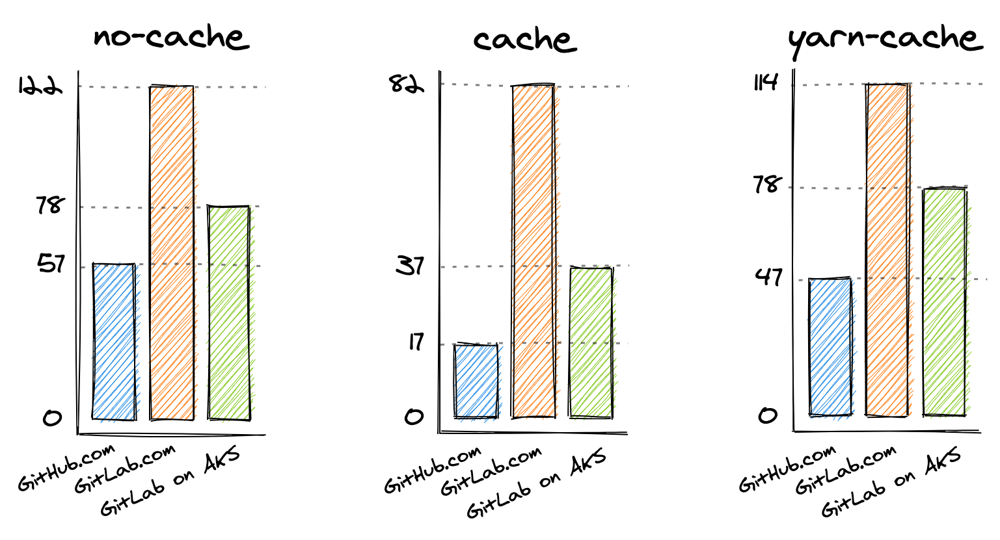

# runners-bench

Bench GitLab VS GitHub runners performance.

- runner github : `ubuntu-latest` with free plan
- runner gitlab : `node:14.15` with free plan and on AKS (France central)

## Network

This is our numbers for big file transfers from data.gouv.fr :

name            | speed
----------------|-------:
GitHub runner   |   20mb/s
GitLab on-prem  | >100mb/s

## Jobs

name       | description
-----------|-------
no-cache   | run a yarn install from scratch
cache      | run a yarn install with `node_modules` runner caching
yarn-cache | run a yarn install using a yarn `.cache` runner caching

## Results

Time in seconds as reported by both UIs.

[](https://excalidraw.com/#json=6269295034105856,oVPVZjXuE1Kt5lHc5D4ITw)

### SaaS (Free accounts)

| runner           | job        | 1st run | 2nd   | 3rd  | 4th  | 5th  | Avg after 1st |
| ---------------- | ---------- | ------: | ----: | ---: | ---: | ---: | ------------: |
| gitlab.com       | no-cache   | 116     | 123   | 114  | 136  | 128  |   **122**     |
| gitlab.com       | cache      | 138     | 87    | 78   | 80   | 84   |   **82**      |
| giltab.com       | yarn-cache | 299     | 111   | 116  | 114  | 114  |   **114**     |
| github.com       | no-cache   | 61      | 61    | 58   | 58   | 58   |   **57**      |
| github.com       | cache      | 64      | 16    | 17   | 19   | 17   |   **18**      |
| github.com       | yarn-cache | 65      | 45    | 49   | 46   | 49   |   **47**      |

### With GitLab on-prem (AKS France)

| runner           | job        | 1st run | 2nd   | 3rd  | 4th  | 5th  | 6th  | 7th  | Avg after 1st |
| ---------------- | ---------- | ------: | ----: | ---: | ---: | ---: | ---: | ---: | :-----------: |
| gitlab #1        | no-cache   | 120     | 141   | 136  | 86   | 86   | 86   | 97   |   **105**     |
| gitlab #1        | cache      | 123     | 113   | 108  | 60   | 62   | 59   | 77   |   **80**      |
| gitlab #2        | no-cache   | 170     | 85    | 85   | 82   | 69   | 81   | 70   |   **78**      |
| gitlab #2        | cache      | 199     | 44    | 34   | 34   | 37   | 36   | 37   |   **37**      |
| gitlab #2        | yarn-cache | 95      | 95    | 96   | 71   | 68   | 69   | 71   |   **78**      |

3x [standard_e4s_v3 nodes](https://pcr.cloud-mercato.com/providers/azure/flavors/standard_e4s_v3) : 4vCPU, 32Gb RAM

\# | description
--|---------------
1 | runner 13.4 + [Cache =  minio + blob Azure STD]
2 | runner 13.8 + [Cache =  blob Azure STD]

#### Runners Config :

```yml
helper_cpu_request = "50m"
helper_memory_request = "256Mi"
cpu_request = "250m"
memory_request = "1Gi"
service_cpu_request = "250m"
service_memory_request = "1Gi"
```

